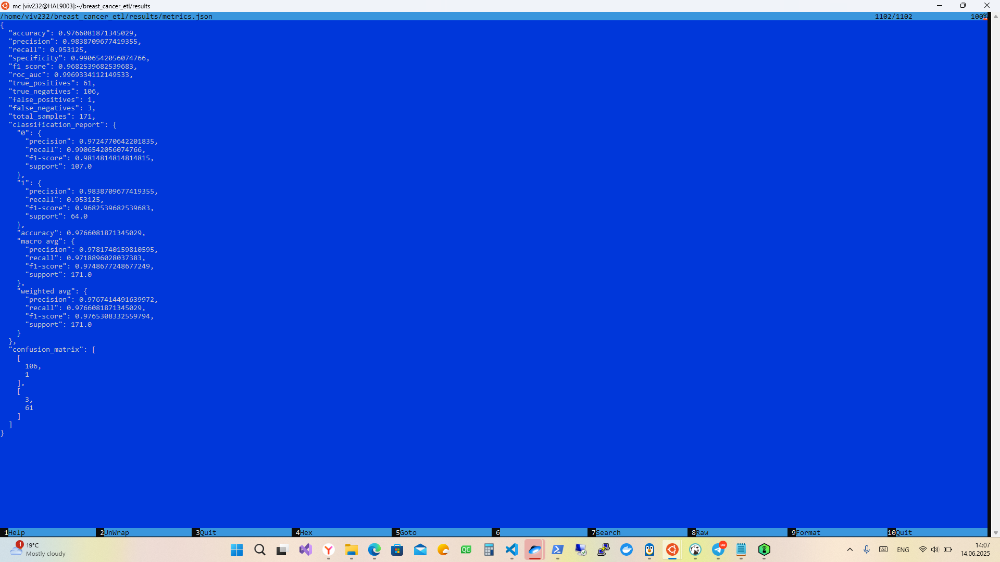

# ETL конвейер задачи Breast Cancer Diagnosis

## Цель проекта

Создание автоматизированного ETL-процесса для обработки медицинских данных Wisconsin Breast Cancer Dataset, обучения модели машинного обучения и выгрузки результатов в облачное хранилище с использованием Apache Airflow.

## ML-задача

**Задача бинарной классификации**: предсказание диагноза рака молочной железы (злокачественный/доброкачественный) на основе характеристик клеточных ядер, полученных из изображений биопсии.

## Архитектура пайплайна

### Этапы пайплайна:

1. **Load Data**: Загрузка CSV-файла с данными
2. **Preprocess Data**: Очистка и подготовка данных
3. **Train Model**: Обучение модели LogisticRegression
4. **Evaluate Model**: Расчет метрик качества
5. **Save Results**: Выгрузка результатов в Google Drive

### Структура проекта
```
breast_cancer_etl/
├── config/
│   ├── config.yaml
│   └── credentials.json
├── data/
│   ├── raw/
│   ├── models/
│   └── metrics/
├── etl/
│   ├── load_data.py
│   ├── preprocess.py
│   ├── train.py
│   ├── evaluate.py
│   └── save_results.py
├── results/
├── logs/
├── utils/
│   ├── logger.py
│   └── validators.py
├── pipeline_dag.py
├── requirements.txt
├── test_imports.py
└── README.md
```
## Скриншоты исполнения

 



